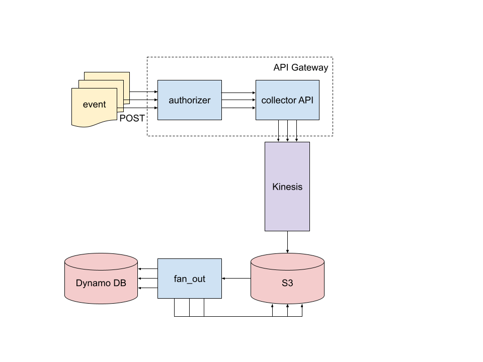

# serverless-event-collector

[Docs](https://3o9x126nr7.execute-api.us-east-1.amazonaws.com/prod/docs)

This is an example repo for a serverless event collector built on AWS. The example involves collecting two types of events: page views from a website, and "clicks" of a button on a website. The diagram below shows the flow of the event data. 



Events are POSTed as JSON-serialized data to a public facing API. The API lives in [API Gateway](https://aws.amazon.com/api-gateway/) and consists of two [Lambda](https://aws.amazon.com/lambda/) functions: the `authorizer` checks the Basic Authentication info in the request and allows or denies the request. Allowed requests get forwarded to the `collector` Lambda function which is actually a [FastAPI](https://fastapi.tiangolo.com/) server deployed as a Lambda function. `collector` validates the request and then drops it into [Kinesis Firehose](https://aws.amazon.com/kinesis/data-firehose/). `collector` also updates [DynamoDB](https://aws.amazon.com/dynamodb/) tables which maintain a count of each event type for each user. These tables are used to power endpoints for GETting real time event counts.

Batches of events from Kinesis get dropped into a bucket on S3. Objects created in that bucket trigger the `fan_out` Lambda function in which events from the main Kinesis bucket get copied into user-specific buckets partitioned by event-type and time.

The entire serverless event collector is deployed together using the [serverless](https://www.serverless.com/) framework with full configuration defined in `serverless.yml`.


## Usage

The event collector collects events via HTTP POST requests. See the [API docs](https://3o9x126nr7.execute-api.us-east-1.amazonaws.com/prod/docs) for documentation. Requests must be authenticated in order to POST to the API. Currently, the `authorizer` function contains a hardcoded map of usernames and passwords for Basic Authentication. In practice, I would recommend using AWS Secrets Manager. Example Python code for collecting a `button_click` event is shown below.

```python
import requests
url = "..."
username = "..."
password = "..."
event = {"button_id": "abc", "session_id": "xyz"}
response = requests.post(url, json=event, auth=(username, password))
response.json()
# {"message": "Received"}
```

## Development

All Lambda functions are python-based and defined in their own directories in this repo. Each Lambda function has unique dependencies that are defined in their respective `requirements.txt` files.

Running `make build` builds virtual environments in each Lambda directory and runs their respective tests. You can also run `make build` from within each directory to just build that individual Lambda function.

The entire application can be deployed from the command line using the [serverless](https://www.serverless.com/) framework. After installing `serverless`, run the following from the root directory of this repo to deploy, where `$STAGE` is `dev`, `staging`, or `prod`

```commandline
serverless deploy --stage $STAGE
```

All AWS resources and components should be built during the deployment process with the exception of S3 buckets for each authenticated user. User-specific buckets should be created manually at `$USER-raw-events`.


## Tests

Build lambda functions and run their tests:

```commandline
make
```
